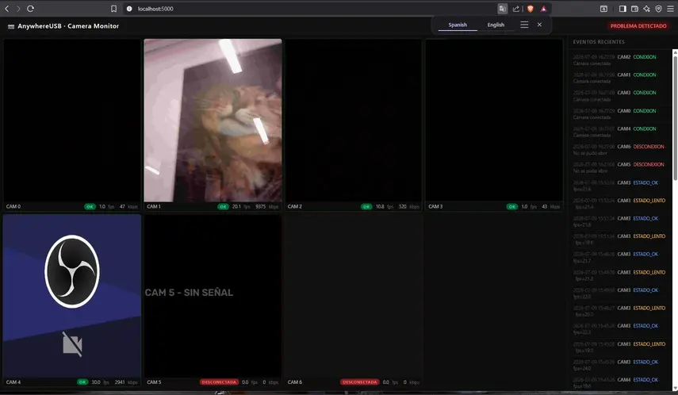
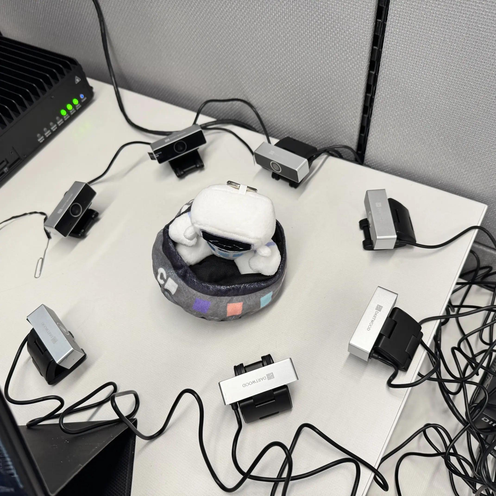
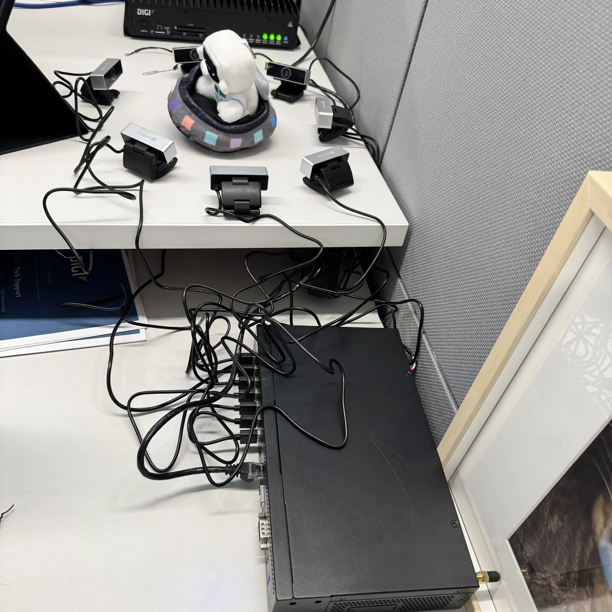

## Dashboard Preview

<p>
  
</p>


## Photos

The images below show the physical camera setup.

<p>
  
</p>

<p>
  
</p>


# AnywhereUSB Camera Monitor

This project captures frames from 7 USB cameras and serves them in real time through a Flask server. Each camera runs in its own thread so capture stays parallel and does not block the rest of the system.

## What It Does

- Streams live MJPEG video from each camera
- Tracks FPS, bitrate, and connection status
- Stores camera metrics and events in SQLite
- Displays a browser dashboard with live health indicators

## Hardware Setup

- 7 USB cameras connected through AnywhereUSB or directly over USB
- Cameras are opened with sequential device IDs in `camera_manager.py`
- The physical layout is shown in the photos below

## Camera Indexing

In `camera_manager.py`:

```python
NUM_CAMERAS = 7
```

- Each camera gets a device index from 0 to 6
- Cameras are opened with `cv2.VideoCapture(index, cv2.CAP_DSHOW)`
- If you add or replace cameras, update `NUM_CAMERAS` and the camera-opening logic in `camera_manager.py`

## Stream Flow

1. Open the camera with the configured index and resolution.
2. Read frames continuously in a loop.
3. Encode frames as JPEG to keep stream size manageable.
4. Calculate FPS and bitrate metrics.
5. Push metrics to a background queue so capture threads never block on storage.

## Browser Endpoints

- `GET /stream/0` to `GET /stream/N` serves MJPEG streams
- `GET /api/stats` returns camera health data as JSON
- `GET /api/events` returns recent events
- The browser refreshes metrics every 2 seconds

## Camera Status

| Status | Meaning | Condition |
|--------|---------|-----------|
| OK | Working normally | FPS is at least 70% of baseline |
| SLOW | Performance degraded | FPS is below 70% of baseline |
| DISCONNECTED | No signal | No frames for 3+ seconds |

## Troubleshooting

- Black image: verify the camera IDs and hardware connection in `camera_manager.py`
- Pending fetch in the browser: check the browser console and CORS configuration
- Low FPS: USB bandwidth may be saturated by 7 cameras at once
- Locked database: the background worker saves metrics asynchronously

## Key Files

| File | Purpose |
|------|---------|
| `camera_manager.py` | Frame capture, threads, and camera state |
| `app.py` | Flask server and HTTP routes |
| `db.py` | Metric and event storage |
| `templates/dashboard.html` | Browser dashboard UI |
| `camera_setup.md` | Detailed technical reference |

